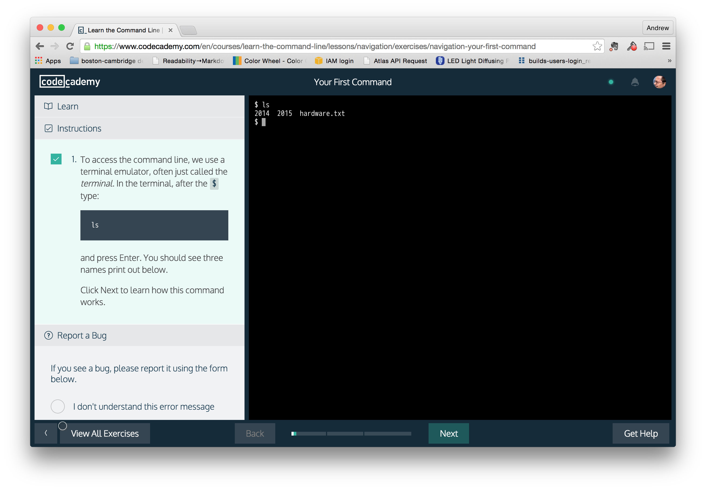

Structured Sandbox
==================

These sites, which are typically geared towards beginners learning a
language or tool, provide a guided introduction using a live code
sandbox. For example, you’re asked to declare a variable of a certain
type, compute a certain value, or perform some task on a data structure
(like reverse an array). Typically, these steps are executed using some
sort of testing suite to confirm that the user performed the task.

-   Strengths

    -   Highly interactive. A user usually cannot progress until they’ve
        successfully completed the coding step.

    -   Granularly structured. The courses are usually very well
        structured, based around tasks or specific exercises.

    -   Game-ifable. It’s very simple to award badges and whatnot based
        on completion.

-   Weaknesses

    -   Complex to develop. The test suites require a specialized author
        who can write the tests.

    -   Rigid. These tend towards lowest common denominator topics that
        can only be expressed in simple, step-by-step tasks

    -   Tend to be slow and plodding, and it’s difficult
        (impossible, really) to jump around. A professional wants to be
        able to extract reliable information quickly, make connections,
        refer back to other parts of the docs, etc.

Examples include:

Codecademy
----------

[Codecademy](http://www.codecademy.com/) offers tutorials in JavaScript,
Python and Ruby. The tutorials are very tightly structured into small
chunks, each with an associated action (like defining a string). The
author uses their custom CMS to create both the narrative material as
well as the "unit tests" that describe the correct answer. While the
classes have generated a lot of buzz and garnered many signups, they
have a high incompletion rate.

Code School (Rails for Zombies, Try Objective-C, etc.)
------------------------------------------------------

[CodeSchool](http://tryobjectivec.codeschool.com/levels/1/challenges/1),
like codecademy, provides guided tours through various languages. Unlike
CodeSchool, each course or class is individually branded. For example,
the jQuery class has an Airline/adventure feel, while the
[Objective-C](http://tryobjectivec.codeschool.com/levels/1/challenges/1)
class has a retro videogame theme.

Try Redis
---------

[Try Redis!](http://try.redis.io/) walks you through the redis database.
The interface is purely text based, making it feel a bilt like an old
text adventure game, like Zork.

